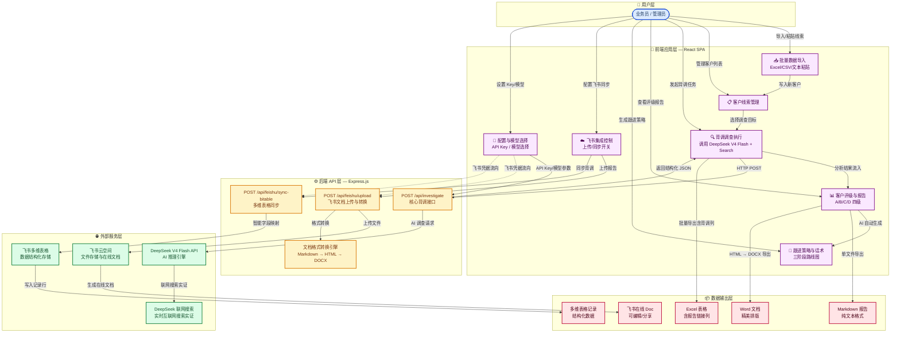

# 🔍 Client Background Investigator v1.0

> **问题复盘与维护注意：** [问题复盘与维护注意事项.md](./问题复盘与维护注意事项.md)

> **项目交接文档：** [项目交接说明.md](./项目交接说明.md) — 新的维护会话请先阅读此文档。  
> **完整操作文档：** [操作说明.md](./操作说明.md)

## 境外客商背景调查专家

> 📘 **完整使用文档：** [操作说明.md](./操作说明.md) — 包含安装启动、Excel 批量背调、飞书同步、功能二精准匹配原理和故障排查。

<div align="center">

**AI 驱动的 B2B 客户尽职调查与商业背景核查系统**

基于 DeepSeek V4 Flash + DeepSeek 联网搜索 搜索实证，对境外 B2B 客户进行深度背景调查、企业资质核验、客户价值评级，并自动生成专业的 Word/Markdown 调查评估报告，一键同步至飞书云文档与多维表格。

</div>

---

## 📑 目录

- [功能概览](#功能概览)
- [技术栈](#技术栈)
- [项目架构](#项目架构)
- [快速开始](#快速开始)
- [环境变量配置](#环境变量配置)
- [核心功能详解](#核心功能详解)
  - [1. 智能背调调查](#1-智能背调调查)
  - [2. 批量数据导入](#2-批量数据导入)
  - [3. 客户评级体系](#3-客户评级体系)
  - [4. 跟进策略生成](#4-跟进策略生成)
  - [5. 报告导出](#5-报告导出)
  - [6. 飞书集成](#6-飞书集成)
  - [7. 自定义 API Key](#7-自定义-api-key)
  - [8. 模型选择与费用估算](#8-模型选择与费用估算)
- [API 接口文档](#api-接口文档)
  - [POST /api/investigate](#post-apiinvestigate)
  - [POST /api/feishu/upload](#post-apifeishuupload)
  - [POST /api/feishu/sync-bitable](#post-apifeishusync-bitable)
- [项目结构](#项目结构)
- [NPM 脚本说明](#npm-脚本说明)
- [部署指南](#部署指南)
- [飞书配置指南](#飞书配置指南)
- [常见问题](#常见问题)

---

## 功能概览

| 模块 | 功能 |
|------|------|
| 🤖 **AI 背调调查** | 利用 DeepSeek V4 Flash + DeepSeek 联网搜索 实时搜索互联网，核查境外企业工商信息 |
| 📊 **批量导入** | 支持 Excel/WPS/CSV 文件上传或粘贴表格文本，智能解析 48 个标准电商字段 |
| 🏷️ **客户评级** | A/B/C/D 四级客户价值评级，辅助业务团队科学分配跟进资源 |
| 📝 **报告生成** | 自动生成专业的中文 Markdown 背调报告，包含企业概况、业务分析、合作评估、跟进策略 |
| 📥 **多格式导出** | 支持导出 Markdown、Word (DOC)、Excel 表格，支持批量 ZIP 打包 |
| ☁️ **飞书集成** | 自动上传报告到飞书云文档（在线 Doc），同步背调数据到飞书多维表格（Bitable） |
| 💰 **费用透明** | 实时核算每次 API 调用的 Token 消耗与预估费用（USD + CNY） |
| 🔑 **灵活配置** | 支持自定义 DeepSeek V4 Flash API Key，所有配置本地加密存储 |

---

## 技术栈

### 前端

- **框架**: React 19 + TypeScript
- **构建工具**: Vite 6
- **CSS 框架**: Tailwind CSS 4
- **图标库**: Lucide React
- **Markdown 渲染**: react-markdown
- **动画**: motion (Framer Motion)
- **表格处理**: xlsx (SheetJS)
- **文件打包**: JSZip

### 后端

- **运行环境**: Node.js + Express.js
- **AI 引擎**: DeepSeek V4 Flash API (`DeepSeek API (Anthropic 兼容端点)` v2)
- **文档转换**: html-to-docx
- **环境变量**: dotenv

### 外部集成

- **DeepSeek V4 Flash API** — AI 推理与搜索实证
- **DeepSeek 联网搜索** — 实时互联网搜索验证
- **飞书开放平台** — 云文档上传、多维表格同步

---

## 项目架构

```
┌─────────────────────────────────────────────────┐
│                    Browser                       │
│  ┌───────────────────────────────────────────┐   │
│  │          React 19 SPA (App.tsx)           │   │
│  │  • 客户线索管理 / 批量导入                 │   │
│  │  • 背调报告预览 / 评级展示                │   │
│  │  • 销售话术 / 跟进清单                    │   │
│  │  • 飞书配置 / 同步控制                    │   │
│  └──────────────┬────────────────────────────┘   │
└─────────────────┼────────────────────────────────┘
                  │ HTTP
┌─────────────────┼────────────────────────────────┐
│                 ▼                         Server  │
│  ┌───────────────────────────────────────────┐   │
│  │          Express.js (server.ts)           │   │
│  │                                            │   │
│  │  /api/investigate                         │   │
│  │    ├─ 调用 DeepSeek V4 Flash API + Search Grounding   │   │
│  │    ├─ 结构化 JSON 输出解析                 │   │
│  │    ├─ 自动重试 + Fallback (无搜索模式)     │   │
│  │    └─ Token 用量统计与费用核算             │   │
│  │                                            │   │
│  │  /api/feishu/upload                       │   │
│  │    ├─ Markdown → HTML → DOCX 转换          │   │
│  │    ├─ 上传飞书云空间                       │   │
│  │    └─ 创建在线文档导入任务                 │   │
│  │                                            │   │
│  │  /api/feishu/sync-bitable                 │   │
│  │    ├─ 智能字段映射 (精确/别名/子串)         │   │
│  │    ├─ 支持新增模式 (batch_create)           │   │
│  │    ├─ 支持更新模式 (batch_update, 订单号匹配)│   │
│  │    └─ Wiki Token 自动降级解析              │   │
│  └──────────────┬────────────────────────────┘   │
└─────────────────┼────────────────────────────────┘
                  │
     ┌────────────┼────────────┐
     ▼            ▼            ▼
  DeepSeek V4    DeepSeek     飞书开放
   Flash API     联网搜索       平台
```

---

## 关系图谱



### 图谱解读

| 层级 | 说明 | 关键关系 |
|------|------|----------|
| **👤 用户层** | 业务员/管理员通过前端工作台操作整个系统 | 触发数据导入、背调执行、报告导出与飞书同步 |
| **📱 前端应用层** | React 19 SPA，集成了客户管理、调查执行、报告展示与导出的完整 UI | 内部数据流向：导入 → 管理 → 调查 → 评级 → 策略；通过 HTTP 调用后端 API |
| **⚙️ 后端 API 层** | Express.js 服务，提供 3 个核心 REST 接口 | 向下调用 DeepSeek V4 Flash API 进行 AI 推理，向上返回结构化 JSON 给前端 |
| **🌐 外部服务层** | DeepSeek V4 Flash/Search 提供智能背调能力，飞书平台提供文档协作 | 背调链路依赖 DeepSeek V4 Flash + Search Grounding；文档同步依赖飞书开放平台 |
| **📦 数据输出层** | 支持 Markdown/Word/Excel/飞书 Doc/Bitable 五种输出形态 | 前端直接导出本地文件，后端代理上传至飞书生态 |

> 💡 **核心数据流**: 业务线索 `→` 批量导入 `→` 客户管理 `→` AI 背调调查（DeepSeek V4 Flash + Search Grounding）`→` 自动评级与报告 `→` 跟进策略生成 `→` 多格式导出 / 飞书同步。

---

## 快速开始

### 前置要求

- **Node.js** ≥ 18
- **npm** ≥ 9
- 一个有效的 **DeepSeek V4 Flash API Key**（可在 [DeepSeek 开放平台](https://platform.deepseek.com/) 充值获取）

### 安装与运行

日常使用且代码没有变化时，可直接双击 `start-fast.bat`，它会复用最近一次构建结果并跳过 Vite/esbuild 构建。修改前端、后端或依赖后，请运行 `start.bat`；需要停止旧服务并加载新代码时运行 `start.bat restart`。

```bash
# 1. 克隆或进入项目目录
cd client-background-investigator-v1.0

# 2. 安装依赖
npm install

# 3. 配置环境变量
# 复制 .env.example 为 .env.local 并填入你的 DEEPSEEK_API_KEY
cp .env.example .env.local

# 4. 开发模式启动
npm run dev
```

启动后访问 **http://localhost:3000** 即可打开工作台。

> ⚠️ **注意**: 即使不配置服务器端的 `DEEPSEEK_API_KEY`，你仍然可以通过页面右上角的「API Key 设置」面板输入个人 Key 来使用。

### Windows 免环境便携版

在已配置开发环境的 Windows x64 电脑执行：

```powershell
npm.cmd run package:portable
```

命令会完成类型检查和生产构建，并在 `release`目录生成版本化 ZIP 与 `.sha256.txt`校验文件。ZIP 已内置 Node.js；目标电脑不需要安装 Node.js 或 npm，解压后双击“启动背调系统.bat”即可。

便携包不包含 API Key、飞书 App Secret、客户数据或浏览器配置。每台电脑首次运行后应独立填写自己的 DeepSeek 和飞书配置。修改代码后需要重新生成并分发新的 ZIP。

### 飞书云文档标题

在线文档标题使用 `收件人名称-中文国家名称-中文产品名称`，例如 `Ava Carter-加拿大-三维成像探宝仪`。收件人来自 Excel 原始“收件人名称”列；中文国家和产品短名称由背调结果生成，并有本地规则兜底。该规则不改变本地 Word、Markdown 或 ZIP 文件名。

---

## 环境变量配置

在项目根目录创建 `.env.local` 文件：

```env
# DeepSeek V4 Flash API 密钥（必填）
DEEPSEEK_API_KEY="sk-..."

# 应用部署 URL（部署时使用）
APP_URL="http://localhost:3000"
```

| 变量名 | 必填 | 说明 |
|--------|------|------|
| `DEEPSEEK_API_KEY` | 是 | DeepSeek V4 Flash API 密钥，用于调用 AI 调查模型 |
| `APP_URL` | 否 | 应用部署的公网 URL，仅在生产环境需要 |

> 你也可以不配置服务器端 Key，在前端页面的「API Key 设置」弹窗中直接输入个人 Key，系统会优先使用前端提供的 Key。

---

## 核心功能详解

### 1. 智能背调调查

系统调用 DeepSeek V4 Flash API 并启用 **DeepSeek 联网搜索**（DeepSeek 联网搜索实证），对目标企业进行实时互联网调查。AI 会搜索和验证：

- 目标国官方工商注册数据库（如波兰 KRS、欧盟 VIES 税号系统）
- 企业官方网站与领英主页
- 行业垂直平台（招聘网站、B2B 产业名录）
- 新闻与商业信誉记录

每次调查返回结构化的 JSON 数据：

```json
{
  "grade": "💎 A级（高价值实体生产型客户，建议重点跟进）",
  "summary": "专业的 2 句中文企业概况与价值总结",
  "riskAlert": "一句话中文风险警告（< 30 字）",
  "followUpStrategy": "中文跟进策略描述（< 40 字）",
  "followUpGrade": "🌟 立即跟进",
  "companyOverview": {
    "legalName": "完整的官方注册全称",
    "taxId": "NIP 1234567890 / KRS 0000123456",
    "website": "https://example.com",
    "industry": "水果及蔬菜后续加工",
    "founded": "2019",
    "status": "Active (在册运行)",
    "headquarters": "Warszawa, Poland"
  },
  "report": "# 完整的 Markdown 背调报告...",
  "sources": [
    { "title": "官方网站", "url": "https://..." }
  ],
  "usage": {
    "promptTokens": 1234,
    "completionTokens": 5678,
    "totalTokens": 6912,
    "modelUsed": "deepseek-v4-flash",
    "searchGroundingUsed": true
  }
}
```

系统内置了智能重试机制：如果 DeepSeek 联网搜索 模式因网络或配额问题失败，会自动降级为纯文本模式重试（最多 3 次），确保调查任务的高可用性。

### 2. 批量数据导入

支持三种导入方式：

#### 📄 文件上传
- 支持 `.xlsx`、`.xls`、`.csv` 格式
- 拖拽文件到上传区域或点击浏览选择
- 自动识别 48 个标准电商/订单列头（订单号、买家名称、收货地址、税号、商品信息等）
- 支持下载标准模板文件

#### ✍️ 文本粘贴
- 直接从 Excel/WPS 复制多行数据，粘贴到文本框
- 自动按 Tab 或逗号分隔解析列
- 格式：`公司名称 [Tab] 国家 [Tab] 订单信息 [Tab] 产品`

#### ✏️ 手动录入
- 逐条填写公司名称、国家、产品信息、订单详情
- 适用于零散客户或无法批量导入的场景

### 3. 客户评级体系

系统根据 AI 分析结果将客户划分为四个等级：

| 等级 | 图标 | 定义 | 推荐策略 |
|------|------|------|----------|
| **A 级** | 💎 | 高价值实体生产商。拥有自建厂房、具备高度匹配的设备采购需求，复购潜力极大 | 立即跟进，深度开发 |
| **B 级** | 🥇 | 优质分销商或大型贸易实体。虽无大规模自产，但具备上下游分销及采购能力 | 重点推进，样品寄送 |
| **C 级** | 🥈 | 散客、小微作坊或餐饮零散商户。采购批量小、复购周期长 | 周期性培育，自动化营销 |
| **D 级** | ❌ | 失联/关闭状态、纯个人买家或空壳公司。无明显商业开发价值 | 暂缓跟进 |

### 4. 跟进策略生成

系统基于企业背景信息自动生成三阶段跟进路线图：

- **阶段一（立即执行）**: 高规格售后触达，建立初步企业信任
- **阶段二（发货后）**: 技术参数切入，摸清客户产能
- **阶段三（收货满意后）**: 全产业链推荐，引导线下长期 B2B 合作

每份报告附带：
- 📧 专业英文 B2B 开发信模板（含邮件标题和正文）
- 💬 即时通讯建联脚本（适用于 WhatsApp/微信/AliExpress IM）
- ✅ 交互式跟进清单（Checkbox 标记完成状态）

### 5. 报告导出

| 格式 | 说明 |
|------|------|
| **Markdown (.md)** | 纯文本 Markdown 格式，单文件导出 |
| **Word (.doc)** | 精美排版的 Word 文档，适合打印或发送给客户/领导 |
| **Excel (.xlsx)** | 在原上传表格基础上新增"背调报告文档"列，方便存档 |
| **ZIP 集体打包** | 包含更新后的 Excel 表格和所有完成的 Word 报告文档 |

### 6. 飞书集成

系统提供完整的飞书生态集成：

#### ☁️ 飞书云文档（在线 Doc）
- 背调完成后自动将报告上传至飞书云空间
- Markdown → HTML → DOCX 自动转换
- 创建导入任务生成可在线编辑的飞书 Doc 文档
- 在线文档转换失败或静默回退时最多执行 3 次导入；最终仍失败则返回原始 `/file` 链接并标记降级状态

#### 📊 飞书多维表格（Bitable）
系统提供**两种同步模式**：

**功能一：新建客商入库（Create 模式）**
- 将背调结果作为全新的记录行追加到多维表格
- 智能 48 字段自动映射
- 支持新增/更新后的映射分析弹窗

**功能二：精准匹配更新（Update 模式）**
- 使用「记录 ID」精确定位，并用「订单号」二次校验；缺少记录 ID 时仅允许唯一订单号兜底
- 精确更新 5 个核心字段：背景评判等级、背景报告文档、风险提示、跟进策略、跟进等级
- 其他字段保持不变，精准高效

#### 🔧 智能字段映射
后端具有三阶段字段匹配策略：
1. **精确匹配**: Excel 列名 → Bitable 字段名（完全一致）
2. **别名匹配**: 通过预定义的 16 组中英文别名智能映射
3. **子串匹配**: 模糊匹配兜底

自动数据强类型转换：文本、数字、日期时间、复选框、单选、多选、人员、电话、URL、附件等飞书字段类型。

### 7. 自定义 API Key

系统支持三级 API Key 配置优先级：

1. **前端自定义 Key**（最高优先级） — 在页面右上角弹窗中输入个人 Key，存储在浏览器 localStorage 中
2. **服务器端 Key** — 通过 `.env.local` 中的 `DEEPSEEK_API_KEY` 配置
3. 如果两者都未配置，系统会提示友好的错误信息并引导用户设置

### 8. 模型选择与费用估算

系统默认采用 **DeepSeek V4 Flash** 模型，在页面顶部实时展示当前模型：

| 模型 | 输入 (百万 Token) | 输出 (百万 Token) | 适用场景 |
|------|-------------------|-------------------|----------|
| `deepseek-v4-flash` | $0.14 | $0.28 | ⭐ 默认推荐，闪电级高精度日常背调 |

- 实时核算每次调查的 **精确 Token 消耗**和 **预估费用**（美元 + 人民币）
- 累计统计面板：显示所有已完成背调的总 Token 消耗和总费用
- 汇率基准：1 USD = 7.25 CNY

---

## API 接口文档

### POST /api/investigate

**核心背调调查接口**

请求体：

```json
{
  "companyName": "Acme Sp. z o.o.",
  "country": "Poland (波兰)",
  "orderInfo": "收件人名称 Acme Sp. z o.o. NIP 123 456 78 90...",
  "productContext": "贴标机 (Labeling Machine)",
  "model": "deepseek-v4-flash"
}
```

请求头（可选）：

```
x-deepseek-api-key: sk-...    （前端提供的自定义 API Key）
```

成功响应（200）：

```json
{
  "success": true,
  "grade": "💎 A级（高价值实体生产型客户，建议重点跟进）",
  "summary": "...",
  "riskAlert": "...",
  "followUpStrategy": "...",
  "followUpGrade": "🌟 立即跟进",
  "companyOverview": { "legalName": "...", "taxId": "...", ... },
  "report": "# 完整 Markdown 报告...",
  "sources": [{ "title": "...", "url": "https://..." }],
  "usage": { "promptTokens": 1234, "completionTokens": 5678, ... }
}
```

错误响应（500/400）：

```json
{
  "success": false,
  "error": "友好的中文错误提示信息"
}
```

错误处理覆盖场景：
- API Key 未配置
- 429 配额/频率限制（含解决方案提示）
- 403 Key 无效
- JSON 解析失败
- 网络超时/断开（自动重试 + Fallback）

---

### POST /api/feishu/upload

**上传背调报告到飞书云空间并转换为在线文档**

请求体：

```json
{
  "appId": "cli_xxxxxxxxxxxxx",
  "appSecret": "••••••••••••",
  "folderToken": "fldcnxxxxxxxxxxxxxxxx",
  "fileName": "2100000000000001.doc",
  "fileContentBase64": "base64编码的HTML内容",
  "markdownContent": "原始 Markdown 内容",
  "companyName": "Acme Sp. z o.o."
}
```

处理流程：
1. 获取 `tenant_access_token`
2. Markdown → HTML → DOCX 二进制转换（使用 `html-to-docx`）
3. 构建 multipart/form-data 上传至飞书
4. 创建 `import_tasks` 导入任务
5. 轮询导入状态（最多 30 次 × 2 秒 = 60 秒）
6. 返回在线文档 URL

成功响应：

```json
{
  "success": true,
  "fileToken": "...",
  "url": "https://xxxx.feishu.cn/docx/..."
}
```

---

### POST /api/feishu/sync-bitable

**同步背调数据到飞书多维表格**

请求体：

```json
{
  "appId": "cli_xxxxxxxxxxxxx",
  "appSecret": "••••••••••••",
  "bitableUrl": "https://xxx.feishu.cn/wiki/xxxxxxxxxxxxxxxxxxxxxxxxx?table=tblexxx",
  "records": [{ "fields": { "companyName": "...", "grade": "...", ... } }],
  "mode": "create"
}
```

`mode`:
- `"create"` — 新增记录（batch_create）
- `"update"` — 匹配并更新已有记录（batch_update）

处理流程：
1. 从 URL 解析 `app_token` 和 `table_id`
2. 获取飞书多维表格的字段 Schema（类型信息）
3. 智能字段映射（精确 → 别名 → 子串匹配）
4. 数据类型强制转换（文本/数字/日期/URL/附件/人员等 17 种类型）
5. **更新模式**: 拉取全量已有记录 → 记录 ID 定位 + 订单号校验（唯一订单号可兜底）→ 批量更新 5 个核心字段
6. **新增模式**: 过滤空行 → 分批 batch_create（每次 ≤100 条）
7. Wiki Token 自动降级解析（解决权限 91403 等错误码）

成功响应（Create 模式）：

```json
{
  "success": true,
  "addedCount": 10,
  "mappingAnalysis": [...]
}
```

成功响应（Update 模式）：

```json
{
  "success": true,
  "updatedCount": 8,
  "unmatchedCount": 2,
  "unmatchedOrders": ["3100000000000002", "Unknown Co."],
  "mappingAnalysis": [...]
}
```

---

## 项目结构

```
client-background-investigator-v1.0/
├── index.html                  # SPA 入口 HTML
├── package.json                # 项目依赖与脚本
├── tsconfig.json               # TypeScript 配置
├── vite.config.ts              # Vite 构建配置
├── server.ts                   # Express 后端（核心 API）
├── .env.example                # 环境变量模板
├── .gitignore                  # Git 忽略规则
├── metadata.json               # 项目元数据
├── README.md                   # 项目文档（本文件）
└── src/
    ├── main.tsx                # React 应用入口
    ├── App.tsx                 # 主应用组件（完整业务逻辑与 UI）
    └── index.css               # Tailwind 配置 + 自定义样式
```

### 关键文件说明

| 文件 | 行数 | 职责 |
|------|------|------|
| `src/App.tsx` | ~3686 行 | 包含全部前端逻辑：客户管理、背调流程、报告渲染、飞书集成、UI 组件 |
| `server.ts` | ~1895 行 | Express 服务器：3 个核心 API、飞书集成、Vite 中间件 |

> 📌 **设计说明**: 当前版本采用单文件组件架构，所有业务逻辑集中在 `App.tsx`。如果需要团队协作或扩展更多功能，建议后续按模块拆分为独立组件和 hooks。

---

## NPM 脚本说明

| 命令 | 说明 |
|------|------|
| `npm run dev` | 启动开发服务器（端口 3000，含 HMR） |
| `npm run build` | Vite 构建前端 + esbuild 打包 server.ts |
| `npm start` | 生产模式运行（需先 build） |
| `npm run preview` | 预览生产构建结果 |
| `npm run clean` | 清理 dist 目录 |
| `npm run lint` | TypeScript 类型检查 |

---

## 部署指南

### 生产构建

```bash
# 1. 构建
npm run build

# 2. 确保 .env.local 包含有效的 DEEPSEEK_API_KEY

# 3. 启动生产服务器
npm start
```

### 部署到服务器 / 云平台

本地部署：配置 `DEEPSEEK_API_KEY` 和 `APP_URL` 环境变量后，运行 `npm run build && npm start` 即可。

### 自托管部署

1. 确保服务器安装了 Node.js ≥ 18
2. 上传项目文件
3. 运行 `npm install`
4. 创建 `.env.local` 并配置 `DEEPSEEK_API_KEY`
5. 运行 `npm run build && npm start`
6. 服务监听在 `0.0.0.0:3000`

---

## 飞书配置指南

### 前置条件

1. 在 [飞书开放平台](https://open.feishu.cn/) 创建一个**自建应用**
2. 在应用后台「开发配置」→「权限管理」中添加以下权限：
   - `drive:file` — 云文档文件读写
   - `bitable:app` — 多维表格读写
   - `wiki:wiki` — 知识库读取（如使用知识库内的多维表格）
3. 在「版本管理与发布」中创建版本并**发布上线**
4. 在「凭证与基础信息」中获取 **App ID** 和 **App Secret**

### 配置云文档同步

1. 在飞书云空间中创建一个目标文件夹
2. 复制浏览器地址栏中 `/folder/` 后面的长字符串作为 **Folder Token**
3. 在应用页面右上角的「配置飞书同步」面板中填入 App ID、App Secret 和 Folder Token

### 配置多维表格同步

1. 在飞书中创建一个多维表格（Bitable），配置好需要的列（建议使用 48 字段标准模板）
2. 打开该多维表格的某个子表，复制完整的浏览器地址栏 URL
3. URL 中需包含 `?table=tble...` 参数
4. **重要**: 将你的自建应用添加为该表格/知识库的**协作者**（点击右上角「分享」→ 搜索应用名称 → 设置为「可编辑」权限）

---

## 常见问题

### Q: 为什么调查一直卡在"核实中"？

A: 可能原因：
1. API Key 配额/频率限制（429 错误）— 等待 1-2 分钟后重试，或升级为付费 Key
2. API Key 无效（403 错误）— 检查 Key 是否正确填写且处于激活状态
3. 网络问题 — 检查服务器到 `api.deepseek.com` 和 `open.feishu.cn` 的连接

### Q: DeepSeek 联网搜索 是什么？

A: 是 DeepSeek V4 Flash API 提供的一项功能，允许模型在生成回复前实时搜索互联网获取最新信息。本系统用它来验证境外企业的工商注册信息、查找官方网站、核对税号等。

### Q: 飞书文档上传后为什么没有变成在线可编辑文档？

A: 自建应用需要将目标文件夹的**编辑权限**授予该应用。请在飞书文件夹中点击「分享」→ 搜索你的应用名称 → 设置为「可编辑」。如果仍然失败，请确认应用已「发布上线」。

### Q: 多维表格同步提示权限错误（91403/1254302）？

A: 这类错误通常是因为：
- **知识库（Wiki）类型**: 使用 `/wiki/` URL 时，需要在该 Wiki 页面的分享设置中添加自建应用为协作者
- **多维表格（Base）类型**: 使用 `/base/` URL 时，需要在表格的协作设置中添加应用
- 无论哪种，都需要在开放平台后台勾选 `bitable:app` 权限并发布上线

### Q: 数据存储在哪里？

A: 所有数据存储在浏览器的 **React state** 和 **localStorage** 中：
- 客户背调数据：仅在当前会话的 React state 中（刷新后丢失，预置示例除外）
- API Key、飞书配置、模型选择：持久化在 localStorage 中

生产环境建议接入后端数据库持久化存储客户数据。

### Q: 支持哪些国家的企业背景调查？

A: DeepSeek V4 Flash + DeepSeek 联网搜索 可以搜索全球公开网页信息。系统在 Prompt 设计上特别优化了对欧盟国家（如波兰 KRS、VIES 税号系统）的检索策略。对于非英语国家，AI 会自动适配目标国的语言进行搜索。

### Q: 如何添加新的模型或修改定价？

A: 模型定价位于 `src/App.tsx` 中的 `PRICING` 对象（约第 104 行）。添加新模型只需在对象中新增对应的键值对，并在模型选择下拉框中添加选项即可。

---

## 🔗 反向链接 — 背调项目知识库

本文档是 **Client Background Investigator v1.0** 的实现层 README，与以下 Vault 文件构成完整的背调项目知识体系：

### 🎯 项目全景

| 链接 | 说明 |
|------|------|
| [[项目/订单信息背调/背调报告/背调的最终目标]] | 🎯 项目愿景、四维目标、KPI 与全景架构 — 理解本系统在 UniData-Sieve 全局中的定位 |
| [[项目/订单信息背调/背调报告/背调报告]] | 📋 背调项目知识索引 MOC — 所有相关文档的一站式导航 |

### ⚙️ 背调模块 1：线索预处理

| 链接 | 说明 |
|------|------|
| [[项目/订单信息背调/背调报告/背调模块1/UniData-Sieve 自动化线索分层系统]] | 🔄 三级分类漏斗、评分矩阵、成本预估 — 本系统的上游数据预处理层 |
| [[项目/订单信息背调/背调报告/背调模块1/UniData-Sieve 邮箱画像模块需求与设计文档]] | 📧 邮箱画像模块设计 — 第一道自动化筛选层的需求文档 |
| [[项目/订单信息背调/背调报告/背调模块1/邮箱画像_Python脚本]] | 🐍 邮箱画像独立脚本 — 可被影刀等工具调用的自动化脚本 |
| [[项目/订单信息背调/背调报告/背调模块1/电商订单地址商业住宅识别方案选型分析报告]] | 🏠 地址分类方案选型 — Mapbox vs DeepSeek V4 Flash 的技术选型分析 |
| [[项目/订单信息背调/背调报告/背调模块1/地址分类_纯推理Prompt]] | 💬 地址分类纯推理 Prompt — 不联网、零成本的兜底方案 |
| [[项目/订单信息背调/背调报告/背调模块1/地址分类_纯推理vs联网搜索_差异对比]] | 📊 地址分类差异对比 — 纯推理 vs 联网搜索的效果对比（决策参考） |

### 🤖 背调模块 2：AI 深度穿透

| 链接 | 说明 |
|------|------|
| [[项目/订单信息背调/背调报告/背调模块2/UniData-Sieve Phase 3]] | 🧠 Phase 3 设计文档 — AI 穿透式客商背调系统的详细架构设计 |
| [[项目/订单信息背调/背调报告/背调模块2/对话版模型_背调Prompt]] | 🎙️ 核心背调 Prompt — 含搜索策略与等级判定标准，是本系统 AI 推理的基础 |
| [[项目/订单信息背调/背调报告/背调模块2/模型3.1 vs 3.5 背调报告差异对比分析]] | 🔬 模型选型分析 — Gemini 3.1 vs 3.5 的背调质量对比与选型建议（历史研究文档） |
| [[项目/订单信息背调/背调报告/背调模块2/案例模板 - Acme Sp. z o.o. 贴标机公司]] | 📋 A 级客户报告模板 — 波兰食品加工企业的完整背调范本 |

### 🏗️ 架构视图

| 链接 | 说明 |
|------|------|
| [[项目/订单信息背调/背调报告/UniData-Sieve架构图.excalidraw]] | 🖼️ UniData-Sieve 全景架构图（Excalidraw） — 可视化查看系统全貌 |

> 💡 **阅读建议**：从 [[项目/订单信息背调/背调报告/背调的最终目标]] 了解项目愿景 → 再回到本文档查看 v1.0 的具体实现 → 最后用 [[项目/订单信息背调/背调报告/背调报告]] MOC 深入各模块细节。

---

<div align="center">

**Client Background Investigator v1.0**  
Powered by DeepSeek V4 Flash DeepSeek 开放平台  
© 2026 — 境外 B2B 客户尽职调查与商业背景核查专家

</div>
