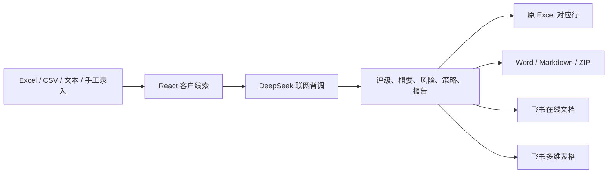
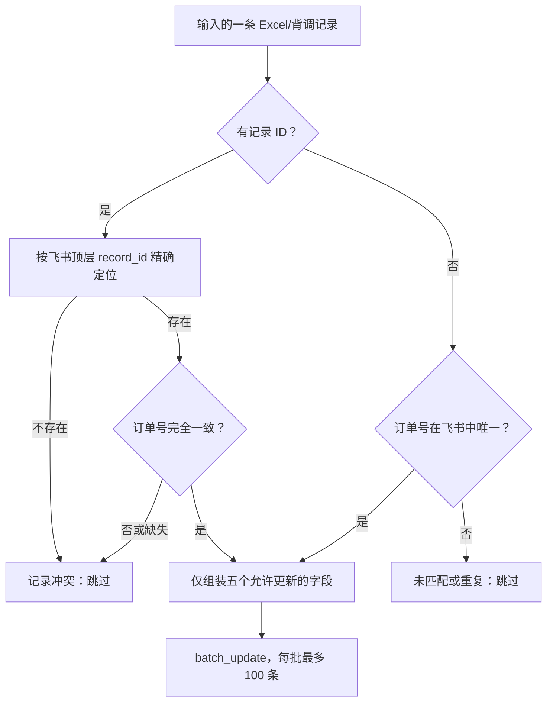

# 境外客商背景调查专家：完整操作与原理说明

本文档适用于业务操作人员、系统管理员和技术维护人员。前半部分说明如何使用系统，后半部分解释 Excel 原行回写、飞书精准匹配、字段映射及常见故障的处理方法。

> 当前版本：Client Background Investigator v1.0  
> 默认地址：`http://localhost:3000`  
> 默认模型：`deepseek-v4-flash`

## 目录

1. [系统用途与工作流程](#1-系统用途与工作流程)
2. [使用前准备](#2-使用前准备)
3. [启动和停止系统](#3-启动和停止系统)
4. [首次配置](#4-首次配置)
5. [导入客户数据](#5-导入客户数据)
6. [执行单条或批量背调](#6-执行单条或批量背调)
7. [查看、导出和同步结果](#7-查看导出和同步结果)
8. [功能一：新建客商入库](#8-功能一新建客商入库)
9. [功能二：精准匹配更新](#9-功能二精准匹配更新)
10. [为什么每条结果能写回对应行](#10-为什么每条结果能写回对应行)
11. [字段识别、映射和类型转换](#11-字段识别映射和类型转换)
12. [接口说明](#12-接口说明)
13. [故障排查](#13-故障排查)
14. [数据安全、限制和最佳实践](#14-数据安全限制和最佳实践)
15. [操作检查清单与验收标准](#15-操作检查清单与验收标准)

---

## 1. 系统用途与工作流程

本系统用于对境外 B2B 客户进行公开信息背景调查，生成客户评级、企业概况、风险提示、跟进建议和完整中文报告。它支持 Excel 批量处理、Word/Markdown/Excel/ZIP 导出，以及飞书云文档和多维表格同步。

典型使用者包括：

- 业务员：导入订单，批量调查客户，查看评级和跟进建议。
- 业务主管：筛选 A/B 级客户，安排跟进优先级。
- 运营人员：维护 Excel、飞书多维表格和报告链接。
- 技术管理员：配置 API Key、飞书应用权限并排查接口问题。



系统不直接修改用户上传的原文件。导出时会复制工作表数据，在副本中写入背调字段并生成一个新文件。

---

## 2. 使用前准备

### 2.1 本地运行要求

- Windows 10/11。
- Node.js 18 或更高版本。
- 可以访问 `api.deepseek.com`；如使用飞书，还需访问 `open.feishu.cn`。
- Chrome 或 Edge 的当前版本。

页面已声明为中文并禁止自动翻译。若浏览器仍启用了第三方翻译扩展，请将 `localhost:3000` 加入“不翻译”列表，避免扩展修改 React 页面节点。

### 2.2 DeepSeek 准备

至少需要一个有效的 `DEEPSEEK_API_KEY`，可采用以下任一方式：

1. 在页面右上角配置自定义 Key；该 Key 优先级最高。
2. 在项目环境文件中配置 `DEEPSEEK_API_KEY`，供服务器统一使用。

页面输入的 Key 会以明文形式保存在当前浏览器的 `localStorage`，不是加密存储。不要在公共电脑中保存生产密钥。

### 2.3 飞书准备

如需上传飞书文档或同步多维表格，需要：

1. 在飞书开放平台创建企业自建应用。
2. 为应用开通云文档、云空间、多维表格权限；知识库场景还需 Wiki 权限。
3. 创建并发布应用版本。
4. 获取 App ID 和 App Secret。
5. 将该应用添加为目标文件夹、多维表格或知识库的可编辑协作者。
6. 准备云空间文件夹 Token 和多维表格完整 URL。

多维表格 URL 应打开到具体子表，推荐保留 `?table=tbl...` 参数。系统支持 `/base/`、`/bitable/` 和 `/wiki/` 类型链接，并在必要时解析 Wiki 节点对应的实际对象 Token。

---

## 3. 启动和停止系统

在项目目录双击 `start.bat`，或从 CMD 中执行：

| 命令 | 用途 |
|---|---|
| `start-fast.bat` | 日常免构建启动；直接使用最近一次成功生成的 `dist` |
| `start.bat` | 重新构建生产文件，然后启动服务 |
| `start.bat fast` | 跳过构建，直接使用现有 `dist` 启动 |
| `start.bat dev` | 启动开发模式和热更新 |
| `start.bat restart` | 停止占用 3000 端口的服务，重新构建并启动 |

推荐直接双击 `start-fast.bat` 进行日常使用。修改了前端、后端或依赖后，应执行 `start.bat restart`，确保重新构建并加载最新代码。若快速启动提示缺少 `dist`，先运行一次 `start.bat`。

成功启动后浏览器会打开 `http://localhost:3000`。如果没有自动打开，可手工输入该地址。

停止服务：选中启动窗口并按 `Ctrl+C`，或关闭启动窗口。修改代码后应执行 `start.bat restart`，并在浏览器按 `Ctrl+F5` 强制刷新。

### 3.1 没有开发环境的电脑

维护人员可在开发机运行 `npm.cmd run package:portable`，从项目的 `release`目录取得 Windows x64 便携版 ZIP 和对应 SHA-256 文件。

目标电脑使用步骤：

1. 将 ZIP 完整解压到本机文件夹，不要直接在压缩包中运行。
2. 双击“启动背调系统.bat”，无需安装 Node.js 或 npm。
3. 浏览器打开后，独立填写该电脑使用的 DeepSeek Key和飞书配置。
4. 导入该电脑负责的 Excel；若使用功能二，配置包含 `table=tbl...`和 `view=vew...`的完整视图链接。
5. 批量运行期间保持启动终端开启，完成后及时导出结果。

便携包内不保存密钥或客户资料。每台电脑的页面配置保存在该电脑浏览器的 `localStorage`。升级时关闭旧服务，将新版 ZIP 解压到新文件夹运行；浏览器访问地址仍是 `localhost:3000`，通常会继续使用原浏览器配置。

---

## 4. 首次配置

### 4.1 配置 DeepSeek API Key

1. 点击页面右上角的 API Key 配置入口。
2. 输入有效 Key 并保存。
3. 模型保持 `deepseek-v4-flash`。
4. 先用一条测试客户执行背调，确认 Key、额度和网络正常。

Key 优先级为：浏览器自定义 Key → 服务器环境变量。旧版 Gemini 配置键仅用于兼容读取，不代表当前仍使用 Gemini。

### 4.2 配置飞书

在“配置飞书同步”面板填写：

| 配置项 | 用途 | 是否必需 |
|---|---|---|
| App ID | 获取租户访问令牌 | 飞书功能必需 |
| App Secret | 获取租户访问令牌 | 飞书功能必需 |
| Folder Token | 报告上传的云空间目录 | 上传飞书文档时必需 |
| 多维表格 URL | 新增或更新多维表格记录 | 表格同步时必需 |
| 自动同步开关 | 背调完成后自动上传/同步单条结果 | 按需开启 |

这些配置同样保存在浏览器 `localStorage`。点击“重置配置”会清除浏览器中的飞书配置。

---

## 5. 导入客户数据

### 5.1 Excel、XLS 或 CSV 文件

1. 点击“批量导入客户”。
2. 选择文件模式，拖放文件或点击选择文件。
3. 系统读取第一个工作表，将第一行作为表头，其余非空行作为客户数据。
4. 等待“成功解析并导入 N 条客户背调线索”提示。
5. 核对客户数量、客户名称、国家和商品信息。

系统按以下优先级确定客户显示名称：

1. 公司类字段：如“公司名称、买家名称、客户名称、Company Name”等。
2. 收件人类字段：找不到公司时，使用“收件人名称”等并标记为个人客商。
3. 买家账号：前两者都没有时使用买家账号。
4. 都没有时生成“客商 #序号”。

国家从“收货国家、国家、Country”等字段识别；产品从“商品信息、产品名称、Product Name、SKU”等字段识别。未识别到产品时使用默认包装设备场景。

每个非空单元格还会以 `[表头]: 值` 的形式加入订单上下文，供 AI 识别订单号、地址、税号、联系方式和商品内容。

> 当前标准未背调表为 1 个工作表、100 条数据、59 列，标准标识列为“订单号”和“记录 ID”。系统不是固定读取 48 列，而是按实际表头动态读取所有列。

### 5.2 粘贴文本

每行代表一个客户，列之间使用制表符分隔：

```text
公司名称<Tab>国家<Tab>订单信息<Tab>产品信息
```

适合少量数据快速处理，但不会保存 Excel 原始列和 `excelRowIndex`，因此不能按原表行导出完整工作表。

### 5.3 手工录入

填写公司名称、国家/地区、订单信息和产品背景后添加。手工客户支持单条背调和报告导出，但没有原始 Excel 行位置。

### 5.4 导入前建议

- 第一行必须是有效表头，避免合并单元格。
- 订单号按文本保存，避免科学计数法或丢失前导零。
- 每一行代表一条独立订单或客户记录。
- 不要在背调过程中再次导入另一个文件；当前程序只保留一份 `originalSheetData`，混合多个文件可能导致回写位置与最后导入的文件不一致。

---

## 6. 执行单条或批量背调

### 6.1 单条背调

在客户列表中点击“立即背调”，或进入客户详情后点击“启动深度 AI 背景调查”。状态依次为：

- 待查 `idle`
- 核实中 `searching`
- 已完成 `completed`
- 失败 `failed`

失败后可以点击重试。只有报告和评级均非空，前端才会把任务标记为完成。

### 6.2 批量背调

1. 导入文件并核对总数。
2. 点击“开始批量背调”或“一键背调待查”。
3. 系统筛选所有待查和失败记录。
4. 按导入顺序逐条等待背调完成，不是同时并发全部请求。
5. 观察已完成、分析中、失败和待处理数量。

串行处理可降低 API 频率限制风险。批次越大，耗时越长；不要关闭页面或刷新浏览器，否则当前客户状态和已生成结果会丢失。

### 6.3 背调结果内容

成功结果包括：

- `grade`：客户评估等级。
- `summary`：报告概要。
- `riskAlert`：风险提示。
- `followUpStrategy`：跟进策略。
- `followUpGrade`：跟进等级。
- `companyOverview`：企业名称、税号、官网、行业、成立时间、状态和地址。
- `report`：完整 Markdown 报告。
- `sources`：联网检索参考来源。
- `usage`：输入、输出、总 Token、模型和联网搜索状态。

报告正文固定按“基本信息 → 订单收货信息 → 企业工商 → 业务分析 → 合作价值 → 跟进策略 → 结论 → 五、参考网站”排列。“参考网站”必须是最后一节，系统会对 AI 返回内容再次归位并对重复 URL 去重。

---

## 7. 查看、导出和同步结果

### 7.1 页面查看

选择客户后可查看：完整报告、跟进话术、参考来源及 Token 使用情况。A/B 级通常代表更高业务价值，但评级是销售辅助信息，不替代法律、财务或制裁合规审查。

### 7.2 单条导出

- Markdown：保存原始报告文本。
- Word：将 Markdown 转为带样式的 Word 兼容文档。
- 飞书在线文档：先生成文档内容，再上传到云空间并执行在线文档导入任务。

飞书导入产物只有 URL 为 `/docx/` 时才视为在线文档。若飞书返回 `/file/` 或明确转换失败，系统会重新上传并最多尝试 3 次；最终仍失败时保留 `/file/`，页面以“飞书原始文件”状态提示。

飞书在线文档标题固定为 `收件人名称-中文国家名称-中文产品名称`，例如 `Ava Carter-加拿大-三维成像探宝仪`。收件人使用 Excel 原始“收件人名称”；中文国家和产品短名称由背调结果生成并带本地兜底。手工录入没有收件人时使用客户/公司名称。标题变化不影响本地导出的文件名。

文件名优先提取订单号；找不到订单号时使用经过清理的公司名称。

### 7.3 批量导出

- “仅下载更新 Excel”：生成包含背调结果的新 Excel 文件。
- “ZIP 集体打包”：包含更新后的 Excel 和每个已完成客户的 Word 报告。
- “同步飞书多维表格”：按当前选中的功能一或功能二执行。

原始上传文件不会被覆盖。

---

## 8. 功能一：新建客商入库

### 8.1 适用场景

目标多维表格中还没有这些订单，需要把 Excel 数据和背调结果作为新记录追加进去。

### 8.2 操作步骤

1. 选择“功能一：新建客商入库”。
2. 导入 Excel 并执行背调。
3. 确认飞书 App ID、Secret 和多维表格 URL。
4. 点击“同步飞书多维表格”。
5. 查看字段映射分析弹窗和新增数量。

### 8.3 写入行为

前端将每一行原始 Excel 字段打包为一条记录，并在对应客户已完成时注入标准背调字段。后端读取目标表字段定义，完成名称匹配和类型转换后调用飞书 `batch_create`，每批最多 100 条。

功能一会新增记录，不会尝试查找已有订单。重复执行可能产生重复行。

---

## 9. 功能二：精准匹配更新

### 9.1 适用场景

订单已经存在于飞书多维表格，只需要把背调结果补充到原记录，不能新增重复订单，也不能覆盖订单金额、地址、物流等业务字段。

### 9.2 操作步骤

1. 确保 Excel 的“记录 ID”来自目标飞书表，且两边订单号一致；两个字段都应为文本、非空且唯一。
2. 在页面选择“功能二：精准匹配更新”。
3. 导入 Excel 并完成背调。
4. 配置并核对目标多维表格 URL，确认当前子表正确。
5. 建议先用 1～3 条数据验证。
6. 点击“匹配更新多维表格”。
7. 查看成功更新数、未匹配数及字段映射结果。

### 9.3 匹配顺序



标准流程先用“记录 ID”与飞书 API 返回的顶层 `record_id` 精确定位，再校验该记录的订单号。只有输入缺少记录 ID 时，才允许使用唯一订单号兜底。有记录 ID但无效时不会静默降级。

订单号比较前会转换为字符串并去除两端空格，但不会去掉内部空格、连字符，也不会自动补回 Excel 已经丢失的前导零。“商品ID”绝不参与订单匹配。

### 9.4 功能二只更新的五个字段

| 标准数据 | 目标含义 | 示例目标列名 |
|---|---|---|
| `grade` | 背景评判等级 | 背景评判等级、背景分析等级、背调等级、评估等级 |
| `feishuUrl` | 背景报告文档 | 背景报告文档、标题、报告链接 |
| `riskAlert` | 风险提示 | 风险提示、风险预警 |
| `followUpStrategy` | 跟进策略 | 跟进策略、开发策略、跟进方案 |
| `followUpGrade` | 跟进等级 | 跟进等级、跟进级别 |

订单金额、地址、物流状态、负责人等其他字段不进入 `fieldsToUpdate`，因此不会被功能二覆盖。

### 9.5 关键边界和风险

- 同时有记录 ID和订单号时，必须定位成功且订单号一致。
- 有记录 ID但目标不存在、缺少订单号或订单号冲突时直接跳过，不降级。
- 缺少记录 ID时，仅允许唯一订单号兜底；订单号重复时跳过。
- 两个标识都缺失时跳过。
- 输入中同一订单重复出现时，可能对同一个 `record_id` 生成多次更新，应在同步前去重。
- 五个目标字段中只写入存在且能通过类型转换的值；空值不会主动清空飞书原值。
- 全部记录都未匹配时接口返回错误，不执行更新。

---

## 10. 为什么每条结果能写回对应行

系统有两套完全不同的“对应”机制，不能混为一谈。

### 10.1 本地 Excel：使用原始行索引

读取 Excel 时，第一行是表头，`rows = sheetData.slice(1)`。遍历每条数据时，系统把该数据在 `rows` 中的零基位置保存为：

```text
lead.excelRowIndex = rowIdx
```

导出时先复制原工作表，再计算：

```text
rowIndex = lead.excelRowIndex + 1
```

`+1` 用于补回被 `slice(1)` 排除的表头行。

示例：

| Excel 可见位置 | 工作表数组索引 | `excelRowIndex` | 导出写入索引 |
|---|---:|---:|---:|
| 第 1 行：表头 | 0 | 不创建客户 | 不写背调结果 |
| 第 2 行：第 1 条数据 | 1 | 0 | 0 + 1 = 1 |
| 第 3 行：第 2 条数据 | 2 | 1 | 1 + 1 = 2 |
| 第 4 行：第 3 条数据 | 3 | 2 | 2 + 1 = 3 |

因此，即使订单号为空或公司重名，本地 Excel 仍能回写到原来的数据行。该过程不根据订单号重新匹配，也不对数据重新排序。

### 10.2 Excel 结果列如何处理

系统先查找已有背调列；存在则复用，不存在则追加到表格末尾：

- 标题
- 评估等级
- 报告概要
- 背调时间
- 风险提示
- 跟进策略
- 跟进等级

完成且报告非空的客户写入全部结果；完成但报告为空时写入警告；失败或未完成时在报告列写入相应状态。原始行先被完整复制，只改目标背调列，所以其他单元格保持原值。

### 10.3 飞书：使用业务标识而不是行号

飞书记录顺序可能与 Excel 不同，分页、筛选和排序也会改变界面位置，所以系统不能使用 Excel 行号。功能二直接使用标准表“记录 ID”定位飞书 `record_id`，并用订单号校验；缺少记录 ID时才使用唯一订单号查找。

| 输出位置 | 对应依据 | 是否依赖订单号 |
|---|---|---|
| 导出的 Excel 副本 | `excelRowIndex + 1` | 否 |
| 飞书功能一 | 每条输入创建一条新记录 | 否 |
| 飞书功能二 | 记录 ID 定位 + 订单号校验，唯一订单号可兜底 | 是，标准表两个标识均必备 |

---

## 11. 字段识别、映射和类型转换

### 11.1 字段名规范化

后端比较字段名时会统一大小写并清理常见分隔符，使中英文变体更容易匹配。功能一大致按以下层次寻找目标字段：

1. 字段名精确对应。
2. 标准字段的预定义别名对应。
3. 规范化后的包含关系作为兜底。
4. 找不到或类型不能转换时跳过该字段，并在映射分析中标记。

### 11.2 关键标识别名

| 含义 | 可识别名称示例 |
|---|---|
| 订单号 | 订单号、订单编号、Order ID、Order No、Order Number、Parent Order ID、交易号 |
| 记录 ID | 记录 ID、记录ID、record_id、recordId、飞书记录ID |
| 公司名称 | 公司名称、公司、企业名称、客户名称、买家名称、Company Name、Company、Name |
| 评级 | 背景分析等级、背调等级、评级、评估等级、信用评级、Grade、Rating、客户等级 |
| 报告链接 | 标题、背景报告文档、背景调查报告文档、飞书文档链接、报告链接、云文档、Report URL、Document Link |
| 风险 | 风险提示、信用风险、风险预警、Risk Alert、Warning |
| 策略 | 跟进策略、开发策略、销售策略、跟进方案、Follow-up Strategy |
| 跟进等级 | 跟进等级、跟进级别、跟进评分、Follow-up Grade、Follow-up Level |

### 11.3 类型转换

- 日期：Excel Date 对象转为 `YYYY-MM-DD HH:mm:ss`；文本日期尝试解析为飞书时间戳。
- 普通数字：保留为数字并按目标字段类型转换。
- 超过 14 位的正数：前端尝试转为字符串，降低长编号精度风险；最佳实践仍是源 Excel 使用文本格式。
- 文本：去除两端空白；空字符串不发送。
- 单选/多选：根据目标字段类型转换为选项值或数组。
- 复选框：识别常见真假文本或布尔值。
- URL、电话、人员、附件等：按飞书字段类型尝试构造；无法安全转换时跳过并记录映射结果。
- 公式、自动编号、创建时间等只读字段不会写入。

字段名匹配成功不代表值一定能写入；目标字段类型不兼容时仍可能出现 `coercion_failed`。

---

## 12. 接口说明

### 12.1 `POST /api/investigate`

用途：执行单条客户背调。

主要输入：`companyName`、`country`、`orderInfo`、`productContext`、`model`。自定义 Key 通过 `x-deepseek-api-key` 请求头传递。

主要输出：`grade`、`summary`、`riskAlert`、`followUpStrategy`、`followUpGrade`、`companyOverview`、`report`、`sources`、`usage`。

服务端会提取模型返回的结构化 JSON，修复部分代码围栏和字符串换行问题，校验报告及评级，并对输出质量问题最多重试三次。

### 12.2 `POST /api/feishu/upload`

用途：上传单条报告并创建飞书在线文档。

输入包括飞书凭据、文件夹 Token、文件名、Base64 文件内容、Markdown 内容和公司名称。接口先上传文件，再创建飞书导入任务并轮询结果。

### 12.3 `POST /api/feishu/upload-sheet`

用途：将完整 Excel 文件上传到飞书云空间并执行导入。该接口保留在后端，当前页面的主要多维表格流程使用 `/api/feishu/sync-bitable`，不要把两者混淆。

### 12.4 `POST /api/feishu/sync-bitable`

用途：同步飞书多维表格。

主要输入：`appId`、`appSecret`、`bitableUrl`、`records`、`mode`。

- `mode=create`：字段映射和类型转换后调用 `batch_create`。
- `mode=update`：读取已有记录，按记录 ID 定位并校验订单号；缺少记录 ID时以唯一订单号兜底，然后调用 `batch_update`。

响应可能包含新增数、更新数、未匹配数和 `mappingAnalysis`。

---

## 13. 故障排查

| 现象 | 常见原因 | 处理方法 |
|---|---|---|
| 页面打不开 | 服务未启动、3000 端口冲突 | 查看启动窗口；执行 `start.bat restart` |
| 修改后页面还是旧版 | 浏览器缓存或使用旧 `dist` | 重新构建并 `Ctrl+F5` |
| 点击后白屏 | 浏览器翻译/扩展改写 DOM、运行时异常 | 关闭翻译扩展，显示原文，刷新；查看 F12 Console 第一条红色错误 |
| 一直“核实中” | API 网络慢、请求未返回 | 查看服务终端；确认可访问 DeepSeek |
| 401/403 | Key 无效、飞书凭据错误或权限不足 | 重填凭据，确认应用已发布并被添加为协作者 |
| 429 | API 额度或频率限制 | 等待后重试，检查账户额度 |
| 空报告/缺少评级 | 模型输出不完整 | 系统会重试；仍失败时点击重试并检查服务日志 |
| Excel 未解析到客户 | 文件没有数据行或格式异常 | 确认第一张工作表、表头和非空数据行 |
| 导出结果写错列 | 表头包含过于相似的名称 | 使用推荐的明确列名，避免多个“等级”或“策略”模糊列 |
| 飞书 91403/1254302 | 应用不是协作者或权限未发布 | 在表格/Wiki 分享设置中添加应用并授予编辑权限 |
| 功能二全部未匹配 | 订单号格式/字段名/目标子表不一致 | 对比两边订单号文本，确认 URL 的 `table` 参数 |
| 部分记录未匹配 | 记录 ID无效、订单号冲突、前导零丢失或订单号重复 | 确认记录 ID来自当前目标表，并核对订单号文本 |
| 字段显示未匹配 | 飞书没有对应列 | 新建推荐列或修改为可识别名称 |
| `coercion_failed` | 飞书字段类型与输入值不兼容 | 调整目标字段类型，或清洗该列数据 |
| 生成重复飞书记录 | 在功能一中重复同步 | 已有订单应使用功能二；同步前备份和去重 |

排错顺序建议：

1. 先看页面红色提示和任务状态。
2. 查看字段映射分析弹窗。
3. 按 F12 查看 Console 和 Network。
4. 查看运行 `start.bat` 的服务终端。
5. 用一条最小测试数据复现，再扩大批次。

---

## 14. 数据安全、限制和最佳实践

### 14.1 数据保存位置

- 客户列表、状态和背调结果保存在 React 内存状态中，刷新或关闭页面后丢失。
- API Key、飞书 App ID/Secret、文件夹 Token、表格 URL 和开关保存在浏览器 `localStorage`。
- 当前版本没有数据库、登录、权限隔离或任务恢复机制。
- `localStorage` 是明文存储，不应在不可信电脑上保存真实密钥。

### 14.2 推荐工作方式

- 导入前备份 Excel；同步前备份飞书多维表格。
- 订单号设为文本、非空且唯一，作为跨系统主标识。
- 功能二以记录 ID和订单号作为双重标识；商品ID和公司名称均不参与匹配。
- 首次配置或修改字段后，先测试 1～3 条记录。
- 等全部背调完成后立即导出 Excel 或 ZIP，避免刷新造成结果丢失。
- 大批次分段执行，关注 API 配额、服务日志和失败数量。
- 不要同时在多个页面对同一份数据执行同步。

### 14.3 已知限制

- 只读取 Excel 的第一个工作表。
- 当前会话只可靠关联最后一次导入文件的原始工作表。
- 批量背调为串行执行，没有暂停、断点恢复和持久化队列。
- 飞书更新的重复键使用第一个匹配结果，不会自动报告全部重复项。
- AI 调查依赖公开网络信息，结果可能不完整或过时，需要人工复核关键结论。
- Token 费用是按代码内置价格和固定汇率估算，不是最终账单。

---

## 15. 操作检查清单与验收标准

### 15.1 背调前

- [ ] 服务成功启动，页面地址为 `http://localhost:3000`。
- [ ] 浏览器未翻译该页面。
- [ ] DeepSeek Key 已验证可用。
- [ ] Excel 第一行是表头，订单号为文本且唯一。
- [ ] 已备份原始 Excel。
- [ ] 如使用飞书，应用已发布并具有目标资源编辑权限。
- [ ] 已确认选择功能一还是功能二。

### 15.2 背调后

- [ ] 已完成数量与预期一致。
- [ ] 失败记录已查看原因并重试。
- [ ] 抽查评级、报告、风险和策略内容。
- [ ] 导出文件中结果位于原客户对应行。
- [ ] 已保存 Excel 或 ZIP，防止刷新丢失。

### 15.3 功能二验收

- [ ] 测试订单在 Excel 和飞书中的订单号完全一致。
- [ ] 更新数量与预期一致，未匹配数量为 0 或已解释。
- [ ] 背景等级、标题、风险提示、跟进策略、跟进等级已写入。
- [ ] 订单金额、地址、物流、负责人等原字段未被改变。
- [ ] 没有产生新的重复记录。

### 15.4 成功标准

一次完整任务应满足：导入数量正确；待查记录均进入完成或明确失败状态；导出 Excel 的客户顺序和原表一致；飞书功能一新增数量或功能二更新数量可核对；抽查记录的报告链接、评级和销售建议与页面一致。

---

## 附录：功能一与功能二快速对照

| 对比项 | 功能一：新建客商入库 | 功能二：精准匹配更新 |
|---|---|---|
| 目标表是否已有订单 | 通常没有 | 必须已有 |
| 飞书动作 | 新增记录 | 更新记录 |
| 主要接口动作 | `batch_create` | `batch_update` |
| 匹配依据 | 不匹配，逐条新增 | 记录 ID定位 + 订单号校验；唯一订单号可兜底 |
| 写入范围 | 可映射的原始字段和背调字段 | 固定五个背调字段 |
| 重复执行风险 | 可能产生重复记录 | 可能重复更新同一记录 |
| 推荐场景 | 创建新的背调客户库 | 给已有订单补充背调结果 |
